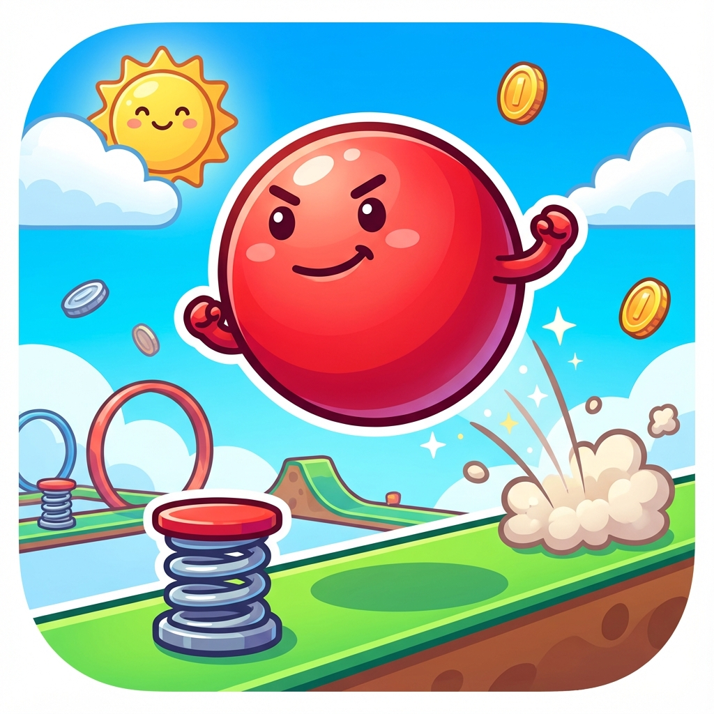
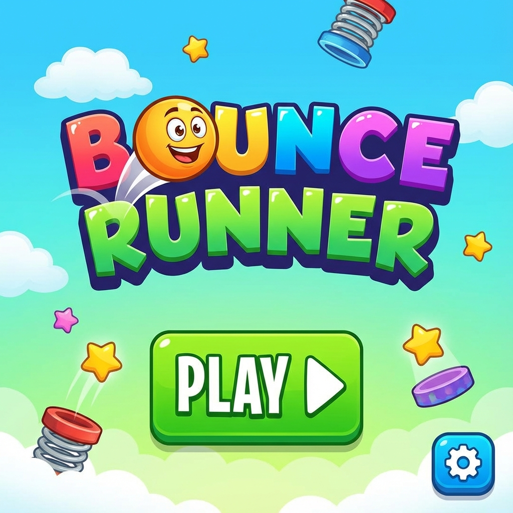
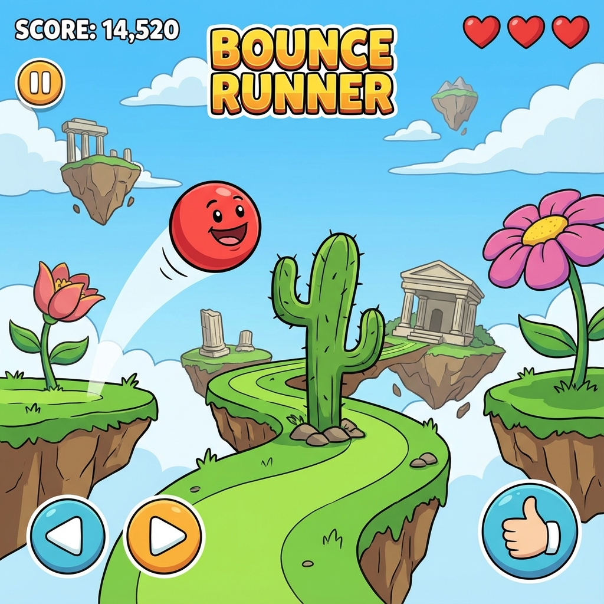
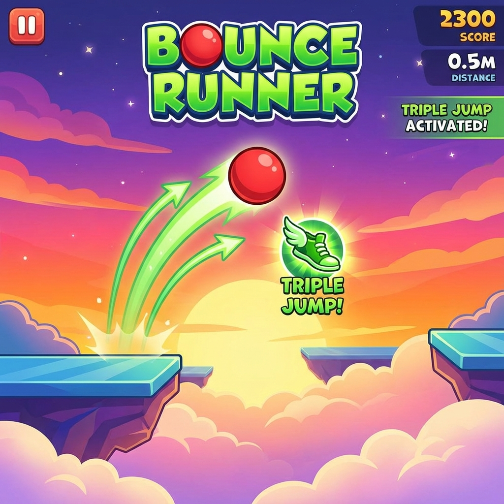

# Bounce Runner 🔴🏃‍♂️



**Bounce Runner** is a vibrant, kid-friendly endless runner game where you control a bouncing ball, dodge obstacles, collect power-ups, and aim for the high score! Built with **Kotlin** and **Jetpack Compose**.

## 🎮 Features

- **Endless Fun**: Infinite scrolling world with increasing difficulty.
- **Simple Controls**: Tap to jump higher! The ball bounces automatically.
- **Power-Ups**:
  - ⬆️ **Triple Jump**: Jump up to 3 times in mid-air!
  - ❤️ **Extra Lives**: Collect hearts to keep running.
- **Dynamic Environment**: Day/Night cycle with sun, moon, and stars.
- **Kid-Friendly Design**: Bright colors, large icons, and forgiving gameplay.
- **Visual Effects**: Particle explosions, screen shake, and smooth animations.
- **High Score System**: Track your best runs locally.

## 🛠️ Tech Stack

- **Language**: Kotlin
- **UI Framework**: Jetpack Compose
- **Architecture**: MVVM (Model-View-ViewModel)
- **Audio**: `SoundPool` for low-latency sound effects.
- **Graphics**: Canvas drawing for custom game rendering.

## 🚀 Getting Started

1.  **Clone the repository**:
    ```bash
    git clone https://github.com/baralmanish/Bounce-Runner.git
    ```
2.  **Open in Android Studio**:
    - Select "Open an existing Android Studio project".
    - Navigate to the cloned directory.
3.  **Build and Run**:
    - Connect an Android device or start an emulator.
    - Click the green "Run" button (▶️).

## 🕹️ How to Play

1.  **Tap anywhere** on the screen to perform a **Jump**.
2.  **Tap again** in mid-air to **Double Jump**.
3.  Collect **Triple Jump** power-ups to unlock a third jump!
4.  Avoid **Cacti**, **Rocks**, and **Birds**.
5.  Collect **Hearts** to regain lives.

## 🤝 Contributing

Contributions are welcome! Feel free to open issues or submit pull requests.

## 📄 License

This project is licensed under the MIT License.

## 📸 Screenshots

|                        Main Menu                        |                          Gameplay                           |                          Power-Up                          |
| :-----------------------------------------------------: | :---------------------------------------------------------: | :--------------------------------------------------------: |
|  |  |  |
